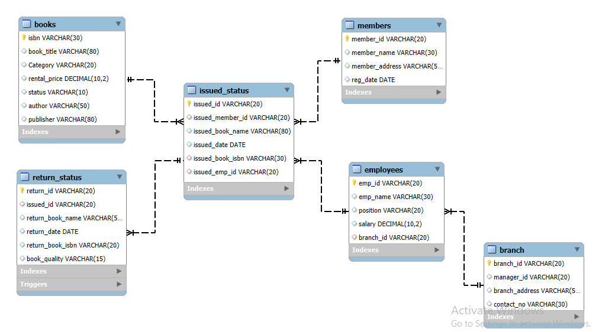

# Library Management System SQL Project 📚

## Project Overview

**Project Title**: Library Management System  
**Database**: MySQL  

This project demonstrates the implementation of a **Library Management System** using **SQL**. It includes the database schema design, data population, and complex SQL queries to manage day-to-day library operations. The project covers the entire lifecycle of a library database, from setting up tables to defining business logic for borrowing, returning, and fining books.


---

## 🚀 Features & Functionality

* **Database Schema Design**: Normalized database with tables for Books, Branches, Employees, Members, Issued Status, and Return Status.
* **Data Integrity**: Usage of Primary Keys, Foreign Keys, and Constraints to ensure referential integrity.
* **Advanced SQL Operations**:
    * **CTAS (Create Table As Select)**: Used for generating summary tables and performance reports.
    * **Stored Procedures**: Automating the book issuing process and managing book availability status.
    * **Triggers**: Automatically updating book status (Available/Not Available) upon return.
    * **Window Functions & CTEs**: Used for advanced data analysis, such as identifying overdue books.
* **Business Analysis**: Solved 20 specific business questions (e.g., branch performance, overdue books, active members).

---

## 🛠️ Tech Stack

* **Database**: MySQL 8.0
* **Language**: SQL (DDL, DML, DQL, TCL)
* **Tools**: MySQL Workbench

---

## 📂 Schema Structure



| Table | Description |
| :--- | :--- |
| **Books** | Contains book details (ISBN, Title, Category, Rental Price, Status). |
| **Branch** | Library branch details and manager information. |
| **Employees** | Staff details and their assigned branches. |
| **Members** | Registered library members. |
| **Issued_Status** | Logs of books issued to members. |
| **Return_Status** | Logs of returned books and their condition. |

---

## 🔍 Key Analysis & Queries

Below are 5 key problems solved using advanced SQL techniques like joins, CTEs, procedures, and aggregations.

---

<details>
<summary><strong>1. Identify Members with Overdue Books (30+ Days)</strong></summary>

*Calculates fines and identifies overdue books.*

```sql
SELECT 
    m.member_id,
    m.member_name,
    b.book_title,
    i.issued_date,
    (current_date() - i.issued_date) AS Over_due_days
FROM members m
JOIN issued_status i ON m.member_id = i.issued_member_id
JOIN books b ON i.issued_book_isbn = b.isbn
LEFT JOIN return_status r ON i.issued_id = r.issued_id
WHERE r.return_date IS NULL
AND (current_date() - i.issued_date) > 30;
``` 
</details>

<details>
<summary><strong>2. Branch Performance Report (Complex Join & Aggregation)</strong></summary>
	
*Generates a summary of total issued books, returned books, and revenue per branch.*

```sql
Copy code
SELECT 
    b.branch_id,
    b.manager_id,
    COUNT(i.issued_id) AS total_books_issued,
    COUNT(r.return_id) AS total_books_returned,
    CONCAT('$', SUM(bk.rental_price)) AS total_revenue
FROM branch b
JOIN employees e ON b.branch_id = e.branch_id
JOIN issued_status i ON e.emp_id = i.issued_emp_id
LEFT JOIN return_status r ON i.issued_id = r.issued_id
JOIN books bk ON i.issued_book_isbn = bk.isbn
GROUP BY b.branch_id, b.manager_id;
```
</details>

<details>
<summary><strong>3. Stored Procedure: Auto-Issue Book</strong></summary>
	
*Checks availability before issuing. If available, issues book & updates status.*

```sql
Copy code
CREATE PROCEDURE book_assign(
    IN p_issued_id VARCHAR(10),
    IN p_issued_member_id VARCHAR(10),
    IN p_issued_book_isbn VARCHAR(30),
    IN p_issued_emp_id VARCHAR(10),
    OUT p_message VARCHAR(255)
)
BEGIN
    DECLARE v_status VARCHAR(10);

    SELECT status INTO v_status 
    FROM books 
    WHERE isbn = p_issued_book_isbn;

    IF v_status = 'yes' THEN
        INSERT INTO issued_status(issued_id, issued_member_id, issued_book_isbn, issued_emp_id)
        VALUES (p_issued_id, p_issued_member_id, p_issued_book_isbn, p_issued_emp_id);

        UPDATE books 
        SET status = 'no' 
        WHERE isbn = p_issued_book_isbn;

        SET p_message = 'Book Issued Successfully';
    ELSE
        SET p_message = 'Book Not Available';
    END IF;
END;
```
</details>

<details>
<summary><strong>4. High-Risk Members (Complex Logic)</strong></summary>

*Identifies members who have damaged books more than twice.*

```sql
Copy code
SELECT 
    m.member_name,
    COUNT(CASE WHEN r.book_quality = 'damaged' THEN 1 END) AS damaged_books_count
FROM issued_status i
JOIN members m ON i.issued_member_id = m.member_id
JOIN return_status r ON i.issued_id = r.issued_id
GROUP BY m.member_name
HAVING COUNT(CASE WHEN r.book_quality = 'damaged' THEN 1 END) > 2;
```
</details>

<details>
<summary><strong>5. CTAS: Overdue Fines Report</strong></summary>
	
*Creates a new table containing fine calculations for overdue members.*

```sql
Copy code
CREATE TABLE fine_report AS
SELECT 
    m.member_id,
    COUNT(i.issued_id) AS books_issued,
    COUNT(
        CASE 
            WHEN DATEDIFF(CURDATE(), i.issued_date) > 30 
            AND r.return_date IS NULL
            THEN 1 
        END
    ) AS overdue_books,
    CONCAT(
        '$',
        COUNT(
            CASE 
                WHEN DATEDIFF(CURDATE(), i.issued_date) > 30 
                AND r.return_date IS NULL
                THEN 1 
            END
        ) * 0.50
    ) AS total_fine
FROM members m
JOIN issued_status i ON m.member_id = i.issued_member_id
LEFT JOIN return_status r ON i.issued_id = r.issued_id
GROUP BY m.member_id;
```
</details>

## 💻 How to Use

1. **Clone the Repository**
   ```sh
   git clone  https://github.com/sonukc9370-ai/Library-Management-System.git

Set Up the Database Execute the SQL scripts in the sql_scripts folder in the following order:

	1. schema_setup.sql
	2. insert_data.sql
	3. Execute analysis_queries.sql to view the reports and data insights.
